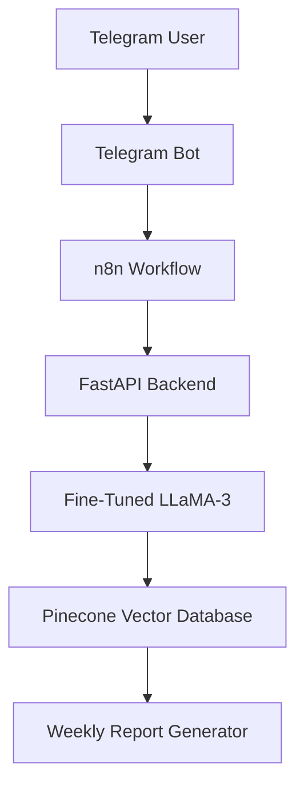
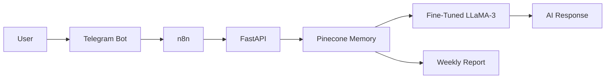

<div align="center">

# 🧠 Mental Health Journal Analyzer

### Fine-Tuned LLaMA-3 Powered AI Journaling Assistant

*A personalized AI journaling assistant powered by a fine-tuned Meta LLaMA-3 model that provides empathetic responses, remembers previous journal entries using semantic memory, and generates AI-powered weekly mood summaries.*

<br>

<p align="center">


</p>

</div>

---

# 📑 Table of Contents

- Overview
- Demo
- Problem Statement
- Features
- Dataset Generation
- System Architecture
- Screenshots
- Model Training
- Training Results
- Workflow
- Tech Stack
- Installation
- Project Structure
- Future Improvements

---

# 📖 Overview

Mental Health Journal Analyzer is an AI-powered journaling assistant designed to provide students with personalized emotional support instead of generic chatbot responses.

Unlike traditional AI assistants, this project remembers previous journal entries using semantic memory and generates context-aware responses based on historical conversations.

The complete system combines

- Meta LLaMA-3 Fine-Tuning
- LoRA (PEFT)
- LangChain Dataset Generation
- Pinecone Semantic Search
- FastAPI Backend
- Telegram Bot
- n8n Automation

to create a scalable AI-powered journaling platform.

---

# 🎥 Demo

Experience the complete AI journaling workflow, from writing a journal entry to receiving a personalized response powered by a fine-tuned LLaMA-3 model.

### Features demonstrated

- 🤖 Fine-tuned LLaMA-3 conversational model
- 🧠 Semantic memory with Pinecone
- 💬 Telegram-based journaling
- 🔄 n8n workflow automation
- 📊 Personalized weekly mood summaries

https://github.com/user-attachments/assets/eab16722-9444-4cb8-9057-d3facc20ccb8

> **Demo Highlights**
>
> - User submits a journal entry through Telegram.
> - The n8n workflow triggers the FastAPI backend.
> - Relevant memories are retrieved from Pinecone.
> - The fine-tuned LLaMA-3 model generates an empathetic response.
> - The journal is stored for future context and weekly mood analysis.

---

# 🎯 Problem Statement

College students frequently struggle with

- Academic pressure
- Anxiety
- Burnout
- Loneliness
- Motivation
- Emotional stress

Existing chatbots generally provide generic replies without remembering previous conversations.

This project addresses that limitation by combining a fine-tuned LLM with semantic memory, allowing the assistant to understand historical context while producing empathetic, personalized responses.

---

# ✨ Key Features

### 🤖 Fine-Tuned LLM

- Fine-tuned Meta LLaMA-3
- LoRA (PEFT)
- Student-focused responses
- Hinglish support

---

### 📚 Custom Dataset

Instead of relying solely on publicly available datasets, a custom instruction dataset was generated using LangChain.

The dataset contains

- Student journal entries
- Emotional reflections
- Academic stress
- Burnout
- Anxiety
- Hinglish conversations
- Motivational conversations

Each training sample follows an

Instruction → Response

format suitable for supervised fine-tuning.

---

### 🧠 Semantic Memory

Journal entries are converted into embeddings and stored in Pinecone.

The assistant can therefore

- Remember previous conversations
- Retrieve relevant memories
- Maintain long-term context
- Generate personalized responses

instead of starting every conversation from scratch.

---

### 📊 Weekly Mood Reports

Every seven days the assistant generates

- Mood Trends
- Emotional Summary
- Positive Highlights
- Areas of Concern
- Personalized Motivation

providing users with a high-level overview of their emotional wellbeing.

---

### 📱 Telegram Assistant

Users communicate naturally through Telegram.

The complete workflow is automated using n8n and FastAPI, making the assistant available without requiring a dedicated web interface.

---

# 🏗️ System Architecture



The architecture follows a modular design where Telegram acts as the user interface, n8n orchestrates the workflow, FastAPI manages backend services, Pinecone provides semantic memory, and the fine-tuned LLaMA-3 model generates context-aware responses.
---

# 📸 Application Screenshots

## 🤖 Telegram Journal Assistant

<p align="center">

</p>

The Telegram Bot serves as the primary user interface, allowing users to journal naturally without opening a separate application.

### Features

- Secure Telegram-based interaction
- Natural language conversations
- Daily journaling
- AI-powered empathetic responses
- Persistent conversation history

---

## 🔄 n8n Workflow Automation

<p align="center">

</p>

The entire workflow is automated using **n8n**, enabling seamless orchestration between Telegram, FastAPI, Pinecone, and the fine-tuned language model.

Workflow responsibilities include:

- Receiving Telegram messages
- Calling backend APIs
- Retrieving semantic memories
- Generating AI responses
- Saving journal entries
- Sending responses back to Telegram

This automation minimizes manual intervention while keeping the pipeline modular and extensible.

---

# 📚 Dataset Generation

Unlike many conversational AI projects that rely solely on publicly available datasets, this project uses a **custom synthetic instruction dataset** created specifically for student mental wellness.

The dataset was generated using **LangChain Prompt Templates**, enabling realistic and diverse journaling conversations.

### Dataset Categories

- 📚 Academic Stress
- 😔 Anxiety
- 😴 Burnout
- 💪 Motivation
- 🌱 Self Reflection
- ❤️ Emotional Support
- 🌍 Hinglish Conversations
- 😊 Positive Reinforcement

Each sample follows an instruction–response format, allowing the model to learn supportive and empathetic conversational behavior.

---

# 🧠 Model Training

The conversational model was fine-tuned using **Meta LLaMA-3** with **LoRA (Low-Rank Adaptation)**, enabling efficient training while significantly reducing computational requirements.

## Training Configuration

| Parameter | Value |
|-----------|-------|
| Base Model | Meta LLaMA-3 |
| Fine-Tuning Method | LoRA (PEFT) |
| Framework | HuggingFace Transformers |
| Dataset | Custom LangChain-generated |
| Backend | FastAPI |
| Vector Database | Pinecone |

### Why LoRA?

LoRA updates only a small subset of model parameters instead of retraining the entire model, making fine-tuning faster and more resource-efficient while maintaining strong performance.

---

# 📉 Training Results

| Metric | Value |
|----------|---------:|
| Initial Training Loss | **1.58** |
| Final Training Loss | **1.07** |


The steady reduction in training loss demonstrates stable convergence during fine-tuning and improved contextual understanding of emotional conversations.

---

# 🔄 End-to-End Workflow



## Workflow Description

### Step 1 — User Journaling

The user writes a journal entry using Telegram.

↓

### Step 2 — Workflow Trigger

n8n receives the incoming message and initiates the automation pipeline.

↓

### Step 3 — Memory Retrieval

Relevant historical journal entries are retrieved from Pinecone using semantic similarity search.

↓

### Step 4 — AI Response Generation

The fine-tuned LLaMA-3 model combines the current journal with retrieved memories to produce an empathetic and context-aware response.

↓

### Step 5 — Memory Update

The latest journal entry is embedded and stored in Pinecone for future conversations.

↓

### Step 6 — Weekly Summary

Every seven days, the system analyzes historical journal entries and generates an AI-powered emotional summary.

---

# 🚀 Technology Stack

| Category | Technologies |
|----------|--------------|
| Programming Language | Python |
| LLM | Meta LLaMA-3 |
| Fine-Tuning | LoRA (PEFT) |
| Framework | LangChain |
| Backend | FastAPI |
| Vector Database | Pinecone |
| Automation | n8n |
| Messaging | Telegram Bot API |
| ML Libraries | HuggingFace Transformers |
| Version Control | Git & GitHub |

---


## Workflow Description

### Step 1 — User Journaling

The user writes a journal entry using Telegram.

↓

### Step 2 — Workflow Trigger

n8n receives the incoming message and initiates the automation pipeline.

↓

### Step 3 — Memory Retrieval

Relevant historical journal entries are retrieved from Pinecone using semantic similarity search.

↓

### Step 4 — AI Response Generation

The fine-tuned LLaMA-3 model combines the current journal with retrieved memories to produce an empathetic and context-aware response.

↓

### Step 5 — Memory Update

The latest journal entry is embedded and stored in Pinecone for future conversations.

↓

### Step 6 — Weekly Summary

Every seven days, the system analyzes historical journal entries and generates an AI-powered emotional summary.

---

# 🚀 Technology Stack

| Category | Technologies |
|----------|--------------|
| Programming Language | Python |
| LLM | Meta LLaMA-3 |
| Fine-Tuning | LoRA (PEFT) |
| Framework | LangChain |
| Backend | FastAPI |
| Vector Database | Pinecone |
| Automation | n8n |
| Messaging | Telegram Bot API |
| ML Libraries | HuggingFace Transformers |
| Version Control | Git & GitHub |

---

# 📂 Project Structure

```text
MentalHealthJournalAnalyzer
│
├── backend/
│   ├── api/
│   ├── services/
│   ├── models/
│   └── utils/
│
├── finetuning/
│
├── dataset/
│
├── prompts/
│
├── telegram_bot/
│
├── n8n/
│
├── notebooks/
│
├── demo/
│   └── demo.mp4
│
├── images/
│   ├── telegram_bot.png
│   ├── workflow.png
│   ├── architecture.png
│   └── training_loss.png
│
├── requirements.txt
├── LICENSE
└── README.md
```

---

# ⚙️ Installation

## Prerequisites

Before running the project, ensure you have:

- Python 3.11+
- Git
- Pinecone Account
- Telegram Bot Token
- n8n
- HuggingFace Access Token (if required)

---

## Clone Repository

```bash
git clone https://github.com/asr09122/mental_health_finetuned_generator.git

cd mental_health_finetuned_generator
```

---

## Create Virtual Environment

### Windows

```bash
python -m venv venv

venv\Scripts\activate
```

### Linux / macOS

```bash
python3 -m venv venv

source venv/bin/activate
```

---

## Install Dependencies

```bash
pip install -r requirements.txt
```

---

## Configure Environment Variables

Create a **.env** file.

```env
PINECONE_API_KEY=xxxxxxxxxxxxxxxx

TELEGRAM_BOT_TOKEN=xxxxxxxxxxxxxxxx

OPENROUTER_API_KEY=xxxxxxxxxxxxxxxx

HF_TOKEN=xxxxxxxxxxxxxxxx
```

---

## Start FastAPI Server

```bash
uvicorn app.main:app --reload
```

Default URL

```
http://127.0.0.1:8000
```

---

## Import n8n Workflow

Open

```
http://localhost:5678
```

Import

```
workflow.json
```

Configure

- Telegram Credentials
- Pinecone Credentials
- FastAPI URL

Run the workflow.

---

## Start Telegram Bot

Open Telegram.

Search your bot.

Start chatting.

The bot will automatically:

- Save journals
- Retrieve memories
- Generate AI responses
- Create weekly summaries

---

# 🔐 Environment Variables

| Variable | Description |
|-----------|-------------|
| PINECONE_API_KEY | Pinecone Vector Database API Key |
| TELEGRAM_BOT_TOKEN | Telegram Bot Token |
| OPENROUTER_API_KEY | OpenRouter API Key |
| HF_TOKEN | HuggingFace Token |

---

# 📈 Future Improvements

The current implementation focuses on text-based journaling.

Planned improvements include

- 🎙 Voice Journaling
- 😊 Emotion Classification
- 📊 Interactive Analytics Dashboard
- 📅 Monthly Mood Trends
- 🌍 Multi-language Support
- ☁ Azure Deployment
- 📱 Android/iOS Application
- 👨‍⚕ Therapist Dashboard
- 🚨 Crisis Detection & Emergency Escalation
- 📤 PDF Report Export
- 🔒 End-to-End Encryption
- 🗣 Speech-to-Text Journaling

---

# 🤝 Contributing

Contributions are welcome.

If you'd like to improve the project,

1. Fork the repository

2. Create a new feature branch

```bash
git checkout -b feature/new-feature
```

3. Commit your changes

```bash
git commit -m "Added new feature"
```

4. Push to your branch

```bash
git push origin feature/new-feature
```

5. Open a Pull Request

---

# 🙏 Acknowledgements

Special thanks to the open-source community.

This project was built using

- Meta LLaMA-3
- HuggingFace
- LangChain
- Pinecone
- FastAPI
- n8n
- Telegram Bot API
- Python

---

# 📜 License

This project is licensed under the **MIT License**.

See the **LICENSE** file for details.

---

# 👨‍💻 Author

<div align="center">

## Abhayjot Singh

**Generative AI Engineer**

Building production-ready AI applications using LLMs, RAG, Multi-Agent Systems, FastAPI and LangChain.

<p align="center">

<a href="https://github.com/asr09122">

</a>

<a href="https://www.linkedin.com/in/abhay-jot-singh-b4201916b/">

</a>

<a href="mailto:asrangpuri09@gmail.com">

</a>

</p>

</div>

---

# ⭐ Support

If you found this repository useful,

please consider giving it a ⭐ on GitHub.

It motivates future development and helps other developers discover the project.

---

<div align="center">

## ❤️ Thank you for visiting this repository!

If you enjoyed exploring this project, don't forget to ⭐ the repository.

Made with ❤️ using **Python**, **Meta LLaMA-3**, **LangChain**, **FastAPI**, **Pinecone**, **n8n**, and **Generative AI**.

</div>
