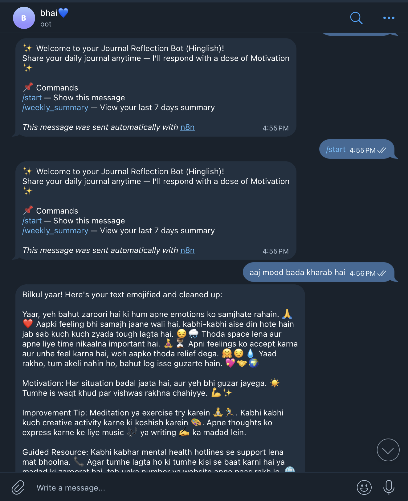
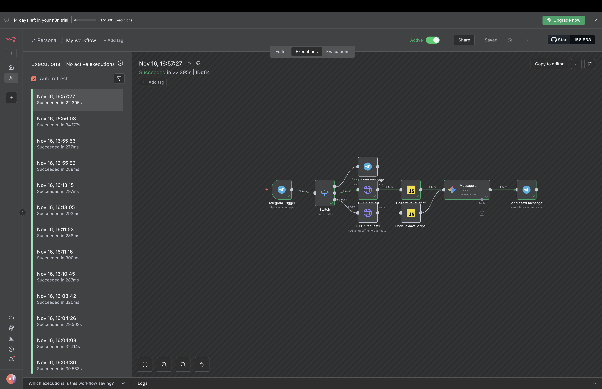

<div align="center">

# 🧠 Mental Health Journal Analyzer

### Fine-Tuned LLaMA-3 Powered AI Journaling Assistant

*An AI-powered journaling assistant that generates empathetic responses using a fine-tuned LLaMA-3 model, remembers previous journal entries through semantic memory, and provides personalized weekly mood reports.*

<p align="center">


</p>

</div>

---

# 📖 Overview

Mental Health Journal Analyzer is an AI-powered journaling system designed to provide students with supportive and empathetic responses rather than generic chatbot replies.

The system combines:

- Fine-Tuned LLaMA-3
- LoRA Fine-tuning
- LangChain Dataset Generation
- Pinecone Semantic Memory
- FastAPI
- Telegram Bot
- n8n Automation

to create a personalized journaling experience.

Unlike traditional chatbots, the assistant remembers previous journal entries and generates weekly emotional summaries.

---

# 🎯 Problem Statement

Students frequently experience:

- Academic stress
- Anxiety
- Burnout
- Emotional ups and downs
- Loneliness
- Motivation issues

Most existing AI chatbots produce generic or robotic replies.

This project focuses on delivering **empathetic, context-aware, and non-diagnostic emotional support** using a fine-tuned LLM trained on student journaling conversations.

---

# ✨ Features

## 🤖 Fine-Tuned LLM

- LLaMA-3
- LoRA Fine-Tuning
- Student-focused responses
- Hinglish support

---

## 📝 Custom Dataset

Instead of relying on publicly available datasets, a custom journaling dataset was generated using **LangChain**.

The dataset includes:

- Student journals
- Hinglish conversations
- Stress
- Anxiety
- Motivation
- Burnout
- Daily reflections

Prompt engineering and structured generation were used to create realistic journal–response pairs.

---

## 🧠 Semantic Memory

Every journal entry is embedded and stored inside Pinecone.

Benefits:

- Previous emotions remembered
- Personalized conversations
- Weekly summaries
- Similar emotion retrieval

---

## 📊 Weekly Mood Reports

Every seven days the system generates

- Mood trend
- Emotional summary
- Positive observations
- Motivational quote

instead of simply returning previous conversations.

---

## 📱 Telegram Integration

Users interact through Telegram.

The workflow is completely automated using n8n.

---

# 🏗️ Architecture

```text
Telegram User
      │
      ▼
Telegram Bot
      │
      ▼
      n8n
      │
      ▼
FastAPI Backend
      │
      ▼
Fine-Tuned LLaMA-3
      │
      ▼
Pinecone Vector Database
      │
      ▼
Weekly Report Generator
```

---

# 📸 Application Screenshots

## 🤖 Telegram Bot

<p align="center">

</p>

Users can interact naturally by writing journal entries directly from Telegram.


## 🔄 n8n Workflow

<p align="center">

</p>

Automation Flow

```
Telegram

↓

n8n

↓

FastAPI

↓

Pinecone

↓

Fine-Tuned LLM

↓

Telegram
```

---

# 🧠 Model Training

## Base Model

LLaMA-3

## Fine-Tuning

LoRA (PEFT)

## Framework

HuggingFace Transformers

## Dataset

Custom LangChain-generated student journal dataset

---

# 📉 Training Results

| Metric | Value |
|----------|---------|
| Initial Loss | **1.58** |
| Final Loss | **1.07** |

The training loss decreased steadily throughout fine-tuning, indicating stable optimization of the model.

---

# 🔄 Complete Workflow

1. User sends a journal through Telegram.
2. Telegram triggers an n8n workflow.
3. FastAPI receives the request.
4. Pinecone retrieves similar past journal entries.
5. Fine-tuned LLaMA-3 generates an empathetic response.
6. Journal entry is stored.
7. Weekly reports summarize emotional trends.

---

# 🚀 Tech Stack

## AI

- LLaMA-3
- LoRA
- LangChain
- HuggingFace

## Backend

- FastAPI
- Python

## Memory

- Pinecone

## Automation

- n8n

## Messaging

- Telegram Bot API

## Deployment

- Docker (Optional)

---

# 📂 Project Structure

```text
MentalHealthJournalAnalyzer
│
├── backend/
├── finetuning/
├── dataset/
├── prompts/
├── telegram_bot/
├── n8n/
├── notebooks/
├── images/
├── requirements.txt
└── README.md
```

---

# ⚙️ Installation

Clone the repository

```bash
git clone https://github.com/asr09122/mental_health_finetuned_generator.git
```

Install dependencies

```bash
pip install -r requirements.txt
```

Run FastAPI

```bash
uvicorn app.main:app --reload
```

Import the n8n workflow and configure:

- Telegram Bot Token
- Pinecone API Key
- LLM credentials

---

# 💡 Future Improvements

- Voice Journaling
- Emotion Dashboard
- Therapist Portal
- Crisis Detection
- Mobile Application
- Multi-language Support
- User Authentication
- Cloud Deployment

---

# 👨‍💻 Author

## Abhayjot Singh

**Generative AI Engineer**

GitHub:
https://github.com/asr09122

LinkedIn:
https://www.linkedin.com/in/abhay-jot-singh-b4201916b/

---

# ⭐ Support

If you found this project useful, consider giving it a ⭐ on GitHub.

It helps the project reach more developers and motivates future improvements.

---

<div align="center">

Built with ❤️ using Python, LLaMA-3, LangChain, FastAPI and Generative AI.

</div>
